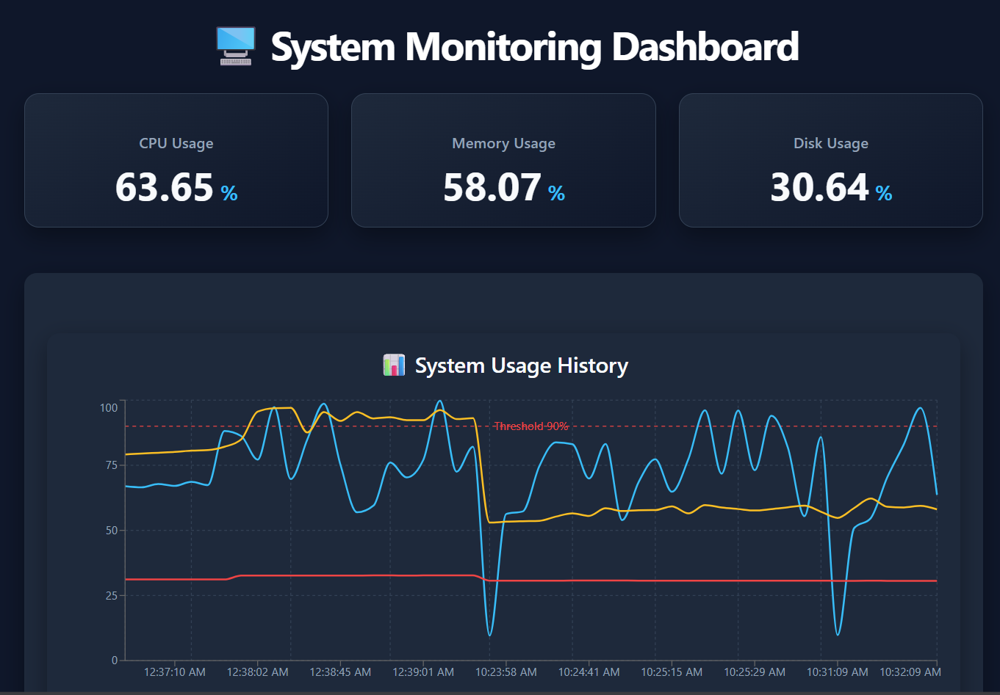
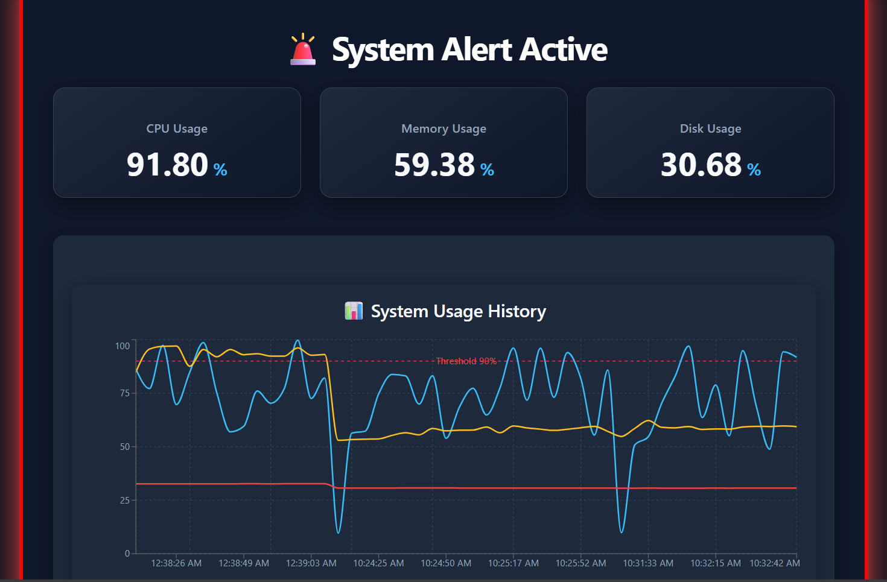

# 🖥️ System Monitoring Dashboard

A full-stack real-time system monitoring dashboard that collects system metrics, stores them in PostgreSQL, detects anomalies, and visualizes system performance through an interactive web dashboard.

---

## 📌 Overview

This project continuously monitors system resources including:

- CPU Usage
- Memory Usage
- Disk Usage
- System Uptime

The backend periodically collects metrics using the `systeminformation` library and stores them in PostgreSQL. The frontend displays live metrics, historical charts, and anomaly alerts.

---

## ✨ Features

- 📊 Real-time system monitoring
- 📈 Historical CPU, Memory, and Disk usage charts
- 🚨 Automatic anomaly detection
- 💾 PostgreSQL database storage
- ⚡ REST API built with Express.js
- 🎨 Responsive React dashboard
- 🔴 Live dashboard alert when anomalies are detected
- 📋 Recent anomaly history table

---

## 🛠 Tech Stack

### Frontend

- React
- Vite
- Recharts

### Backend

- Node.js
- Express.js

### Database

- PostgreSQL

### System Monitoring

- systeminformation

---

## 📂 Project Structure

```
System-monitoring/
│
├── backend/
│   ├── collector/
│   ├── config/
│   ├── controllers/
│   ├── routes/
│   ├── services/
│   └── server.js
│
├── frontend/
│   ├── src/
│   │   ├── components/
│   │   ├── services/
│   │   ├── styles/
│   │   └── App.jsx
│
├── architecture.md
└── README.md
```

---

## ⚙️ How It Works

1. Backend collects system metrics every **5 seconds**.
2. Metrics are stored inside PostgreSQL.
3. Threshold-based anomaly detection checks:
   - CPU > 90%
   - Memory > 90%
   - Disk > 95%
4. Detected anomalies are stored in the database.
5. React frontend fetches updated data every 5 seconds.
6. Dashboard displays:
   - Current system status
   - Historical trends
   - Recent anomalies

---

## 📊 Dashboard Components

### Metric Cards

Displays current:

- CPU Usage
- Memory Usage
- Disk Usage

---

### Historical Chart

Visualizes:

- CPU Usage
- Memory Usage
- Disk Usage

with threshold indicator.

---

### Anomaly Table

Displays:

- Metric type
- Current value
- Threshold
- Detection message
- Detection time

---

## Dashboard Preview

### Main Dashboard



### Anomaly Alert



### Anomaly Table


## 🚀 Installation

### Clone repository

```bash
git clone <repository-url>
```

### Backend

```bash
cd backend
npm install
npm run dev
```

### Frontend

```bash
cd frontend
npm install
npm run dev
```

---

## 🔌 API Endpoints

### Latest Metrics

```
GET /api/metrics/latest
```

Returns the latest collected metrics.

---

### Metrics History

```
GET /api/metrics/history
```

Returns recent historical metrics.

---

### Recent Anomalies

```
GET /api/anomalies
```

Returns recently detected anomalies.

---

## 🚧 Future Improvements

- Machine Learning based anomaly detection
- WebSocket real-time updates
- Email notifications
- Docker deployment
- User authentication
- Prometheus integration
- Grafana integration

---

## 📄 License

This project is created for educational purposes.